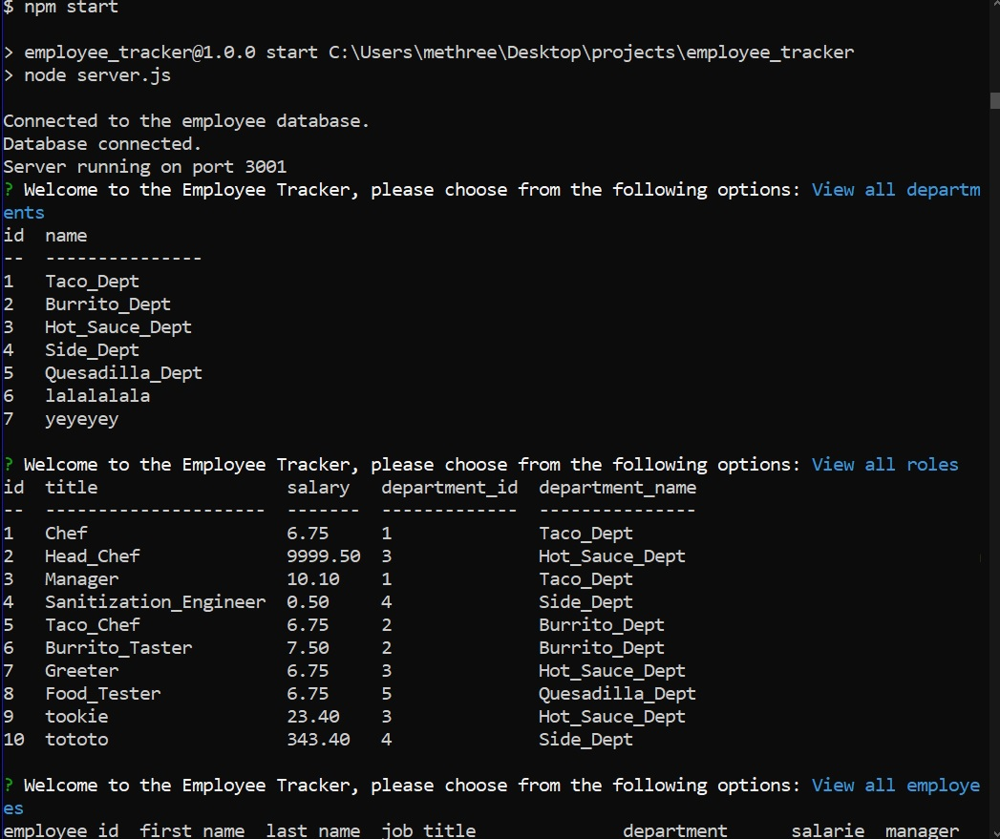

 

  <h1 align="center">Employee Tracker</h1>

## Description 

This code, when run via node.js, can be used to view and control a employee database.

## Table of Contents

* [Usage](#usage)
* [Contributing](#contributing)
* [Tests](#tests)
* [License](#license)
* [Questions](#questions)
* [Links](#links)

## Usage 

1. Install node, mysql2 and all dependendies.
2. Run the schema and seeds file to get started.
3. Start the server with npm start.
4. Follow the intructions to modify your database!

## Contributing

No contributions at this time please, but your are free to use this code in your own project given the license listed below.

## Tests

I welcome any tests or suggestions to better this project in the future.

## License

This project is covered under the MIT license.

## Questions

I can be contacted via email or on github at:

* E-mail: johntaylorwoodland@gmail.com
* Github: https://github.com/jondagamkd/

## Links

The video can be reached [HERE](https://watch.screencastify.com/v/xTmfOzeu6L1ZipZpkeUK)

